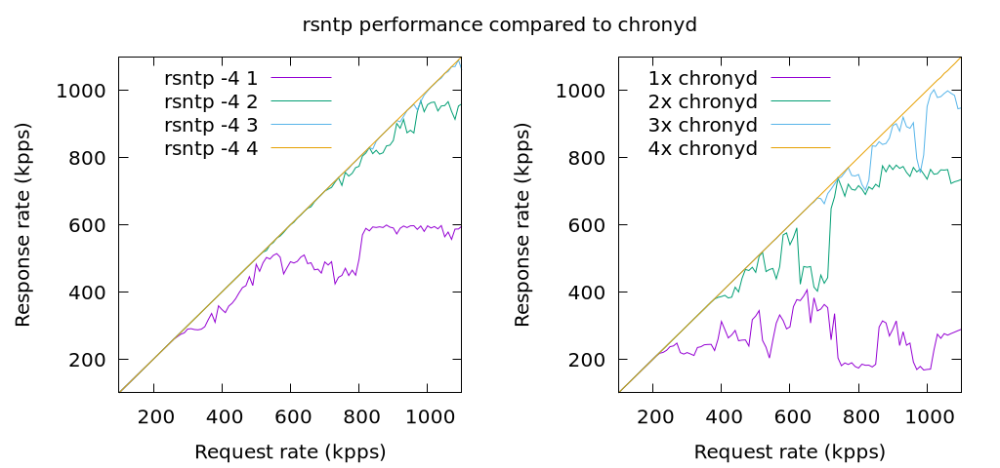

= rsntp

+rsntp+ is an experimental high-performance NTP server written in Rust. It does
not implement a full NTP client and relies on another NTP client and server to
be running on the system instead. It periodically updates its state to mirror
the real NTP client/server and uses multiple threads to serve the current
system time.

By default, +rsntp+ uses one thread for IPv4 and another for IPv6. In order to
get the best performance, it's necessary to increase the number of threads
using the +--ipv4-threads+ and +--ipv6-threads+ options to correspond to the
number of CPU cores available on the system.

The real NTP client/server needs to be configured to listen on 127.0.0.1 on
port 11123 (or another port if specified with the +--server-addr+ option). For
instance, the following configuration should work with +chronyd+:

----
allow 127.0.0.1
port 11123
bindaddress 127.0.0.1
----

The following graphs compare the +rsntp+ performance with +chronyd+ (version
4.1), as measured by https://github.com/mlichvar/ntpperf[+ntpperf+]. The tests
ran on a Linux machine with an Intel E5-1220 CPU (4 cores) and a 1Gb/s Intel
I350 network card. The maximum rate of NTP requests and responses at the 1Gb/s
speed is about 1100k per second.

The graphs show that with +rsntp+ the server starts dropping packets at a
higher rate than +chronyd+ and its performance is more stable as the rate of
requests is increasing. +chronyd+ does not use multiple threads as a server. It
needs to be started in multiple instances sharing the server port in order to
utilize multiple CPU cores. It starts dropping packets at a lower rate and the
response rate is jumping up and down as the request rate is changing. With both
implementations 4 threads/instances are needed on this system to fully saturate
the 1Gb/s link without any packets dropped, but +rsntp+ with 3 threads is very
close to it.
