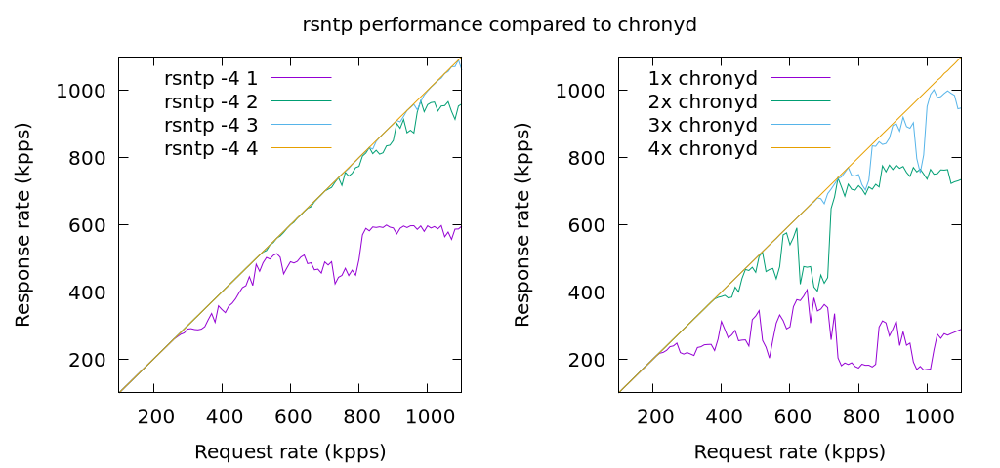

= rsntp

+rsntp+ is an experimental high-performance NTP server written in Rust. It does
not implement a full NTP client and relies on another NTP client and server to
be running on the system instead. It periodically updates its state to mirror
the real NTP client/server and uses multiple threads to serve the current
system time.

By default, +rsntp+ uses one thread for IPv4 and another for IPv6. In order to
get the best performance, it's necessary to increase the number of threads
using the +--ipv4-threads+ and +--ipv6-threads+ options to correspond to the
number of CPU cores available on the system.

The real NTP client/server needs to be configured to listen on 127.0.0.1 on
port 11123 (or another port if specified with the +--server-addr+ option). For
instance, the following configuration should work with +chronyd+:

----
allow 127.0.0.1
port 11123
bindaddress 127.0.0.1
----

The following graphs compare the +rsntp+ performance with +chronyd+ (version
4.1), as measured by https://github.com/mlichvar/ntpperf[+ntpperf+]. The tests
ran on a Linux machine with an Intel E3-1220 v6 CPU (4 cores) and a 1Gb/s Intel
I350 network card. The maximum rate of NTP requests and responses at the 1Gb/s
speed is about 1100k per second.

The graphs show that with +rsntp+ the server starts dropping packets at a
higher rate than +chronyd+ and its performance is more stable as the rate of
requests is increasing. +chronyd+ does not use multiple threads as a server. It
needs to be started in multiple instances sharing the server port in order to
utilize multiple CPU cores. It starts dropping packets at a lower rate and the
response rate is jumping up and down as the request rate is changing. With both
implementations 4 threads/instances are needed on this system to fully saturate
the 1Gb/s link without any packets dropped, but +rsntp+ with 3 threads is very
close to it.

== Metrics support

+rsntp+ provides optional metrics collection and HTTP endpoints for monitoring
server performance and client activity.  When enabled with the
+--metrics-address+ option, the following HTTP endpoint becomes available:

+/metrics+ - Prometheus-compatible metrics in text format

With the addition of the +--client-cache+ option, the following HTTP endpoint
becomes available:

+/clients+ - List of unique client IP addresses with request counts in CSV
format (this is a rudimentary equivalent to +ntpd -nc mrulist+ or +chronyc -n
clients+ for rsntp)

Metrics and client cache are both disabled by default; there are no defaults for
their values.  The client cache periodically must be an integer number of
seconds and the metrics address must be an address:port pair.

The metrics include packet event counters, timing information, packet size
histograms, and process resource usage statistics.  Metrics must be enabled for
client cache to be enabled.  If client cache is enabled, the metrics also
include unique client counts by time period.

Example to start rsntp with metrics and client cache support with a maximum of
128K clients for a 1 minute cache, and 1024K clients for a 1 hour cache:

----
rsntp --ipv6-address [2001:db8:1:2::7b]:123 --metrics-address [::1]:12345 --client-cache 128,60 --client-cache 1024,3600 &
----

Note that enabling client cache can be extremely memory intensive, and you
should choose appropriate limits and periods for your load.  The effect of
enabling metrics on +rsntp+'s performance has not been measured on high load
systems and is left as an exercise for the user.

Retrieving metrics:

----
$ curl -s [::1]:12345/metrics
# HELP rsntp_first_seen_time First time each packet event was seen (Unix nanoseconds).
# TYPE rsntp_first_seen_time gauge
rsntp_first_seen_time{thread_id="0",packet_event="client_receive_failed"} 1754149059888966149
rsntp_first_seen_time{thread_id="0",packet_event="client_request_sent"} 1754095641157550773
rsntp_first_seen_time{thread_id="0",packet_event="client_response_received"} 1754095641157705319
rsntp_first_seen_time{thread_id="2",packet_event="server_request_received"} 1754095641206039321
rsntp_first_seen_time{thread_id="2",packet_event="server_receive_failed"} 1754099103475955536
rsntp_first_seen_time{thread_id="2",packet_event="server_response_sent"} 1754095641206117286
rsntp_first_seen_time{thread_id="2",packet_event="server_unsupported_version"} 1754099103475938676
# HELP rsntp_last_seen_time Last time each packet event was seen (Unix nanoseconds).
# TYPE rsntp_last_seen_time gauge
rsntp_last_seen_time{thread_id="0",packet_event="client_response_received"} 1754199817786192483
rsntp_last_seen_time{thread_id="2",packet_event="server_unsupported_version"} 1754187197337029246
rsntp_last_seen_time{thread_id="2",packet_event="server_request_received"} 1754199818529319613
rsntp_last_seen_time{thread_id="0",packet_event="client_request_sent"} 1754199817786061650
rsntp_last_seen_time{thread_id="2",packet_event="server_response_sent"} 1754199818529387914
rsntp_last_seen_time{thread_id="2",packet_event="server_receive_failed"} 1754187197337063231
rsntp_last_seen_time{thread_id="0",packet_event="client_receive_failed"} 1754157087664801849
# HELP rsntp_packets NTP packet event counters.
# TYPE rsntp_packets counter
rsntp_packets_total{thread_id="0",packet_event="client_response_received"} 104100
rsntp_packets_total{thread_id="2",packet_event="server_receive_failed"} 4
rsntp_packets_total{thread_id="0",packet_event="client_request_sent"} 104107
rsntp_packets_total{thread_id="2",packet_event="server_unsupported_version"} 4
rsntp_packets_total{thread_id="2",packet_event="server_request_received"} 2498429
rsntp_packets_total{thread_id="2",packet_event="server_response_sent"} 2498429
rsntp_packets_total{thread_id="0",packet_event="client_receive_failed"} 7
# HELP rsntp_packet_size_bytes NTP packet size in bytes.
# TYPE rsntp_packet_size_bytes histogram
rsntp_packet_size_bytes_sum 119924922.0
rsntp_packet_size_bytes_count 2498433
rsntp_packet_size_bytes_bucket{le="47.0"} 0
rsntp_packet_size_bytes_bucket{le="55.0"} 2498429
rsntp_packet_size_bytes_bucket{le="127.0"} 2498433
rsntp_packet_size_bytes_bucket{le="+Inf"} 2498433
# HELP rsntp_unique_clients Number of unique client IP addresses by time period.
# TYPE rsntp_unique_clients gauge
rsntp_unique_clients{period="86400"} 503582
rsntp_unique_clients{period="3600"} 41606
rsntp_unique_clients{period="60"} 1404
# HELP rsntp_process_fds Process file descriptors by type.
# TYPE rsntp_process_fds gauge
rsntp_process_fds{fd_type="open"} 154
rsntp_process_fds{fd_type="max"} 524288
# HELP rsntp_process_memory_bytes Process memory usage in bytes by type.
# TYPE rsntp_process_memory_bytes gauge
rsntp_process_memory_bytes{memory_type="peak"} 1039429632
rsntp_process_memory_bytes{memory_type="pin"} 0
rsntp_process_memory_bytes{memory_type="rss"} 211402752
rsntp_process_memory_bytes{memory_type="size"} 967446528
rsntp_process_memory_bytes{memory_type="swap"} 606208
rsntp_process_memory_bytes{memory_type="data"} 231411712
rsntp_process_memory_bytes{memory_type="lib"} 1654784
rsntp_process_memory_bytes{memory_type="pte"} 552960
rsntp_process_memory_bytes{memory_type="hwm"} 211566592
rsntp_process_memory_bytes{memory_type="lck"} 0
rsntp_process_memory_bytes{memory_type="stk"} 135168
rsntp_process_memory_bytes{memory_type="exe"} 1069056
# HELP rsntp_process_runtime_seconds Process runtime in seconds with version info.
# TYPE rsntp_process_runtime_seconds gauge
rsntp_process_runtime_seconds{rsntp_version="0.1.0",rust_version="1.88.0"} 104177
# HELP rsntp_process_threads Number of OS threads in the process.
# TYPE rsntp_process_threads gauge
rsntp_process_threads 12
# EOF
----

Retrieving clients:

----
$ curl -s [::1]:12345/clients?period=60
2001:db8:107:6d00:24ca:2884:d339:9eec,1
2001:db8:1902:9600:4cd4:1ccd:f180:45c5,1
2001:db8:4201:4c00:e73c:1545:aa58:94e1,2
2001:db8:4205:8800:9e0b:1321:5667:9159,2
2001:db8:4306:dd00:170:fb66:fb09:bc33,1
2001:db8:5b03:a500:4354:5b43:9c1e:1740,1
2001:db8:5c05:b200:52e6:716f:9518:a553,5
2001:db8:5c07:1900:119d:bfcf:a31b:e245,1
2001:db8:5d02:ef00:c3cc:3c1b:b9ba:f591,1
2001:db8:6203:a000:8dc5:aac6:5097:420c,3
2001:db8:6208:be00:2f67:3b89:bd9f:4a9,2
2001:db8:630b:f900:62b7:e90:5962:af90,1
...
----
